<!-- =================================================== -->
<!-- HERO SECTION : GRAPHIC NOVEL OPENING SPLASH PANEL   -->
<!-- =================================================== -->

  

 

<!-- =================================================== -->
<!-- NARRATIVE TERMINAL LOG                              -->
<!-- =================================================== -->

  

 

<!-- =================================================== -->
<!-- ORGANIC WEB CONNECTOR & CRAWLING SPIDER ANIMATION   -->
<!-- =================================================== -->

  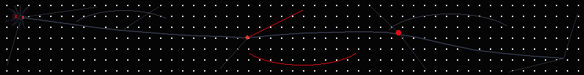

 

<!-- =================================================== -->
<!-- PROJECTS SECTION : DARK COMIC BOOK PANELS           -->
<!-- =================================================== -->

  

<table align="center" width="850" border="0" cellspacing="0" cellpadding="0" style="border-collapse: collapse; max-width: 100%;">
  <tr>
    <td align="center" width="50%" style="padding: 6px; border: none;">
      <a href="https://github.com/animeshy071-web/siportal">
        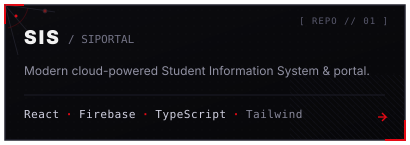
      </a>
    </td>
    <td align="center" width="50%" style="padding: 6px; border: none;">
      <a href="https://github.com/sakshamwadhankar/TruthLens">
        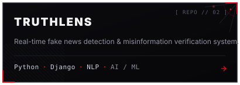
      </a>
    </td>
  </tr>
  <tr>
    <td align="center" width="50%" style="padding: 6px; border: none;">
      <a href="https://github.com/sakshamwadhankar/CodeRush2.0_Dead_Pixel">
        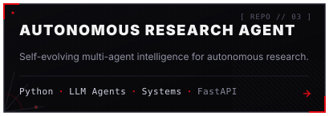
      </a>
    </td>
    <td align="center" width="50%" style="padding: 6px; border: none;">
      <a href="https://github.com/sakshamwadhankar/blockchain-voting">
        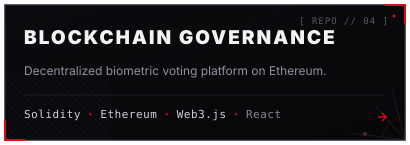
      </a>
    </td>
  </tr>
  <tr>
    <td align="center" width="50%" style="padding: 6px; border: none;">
      <a href="https://github.com/sakshamwadhankar/Far-Away">
        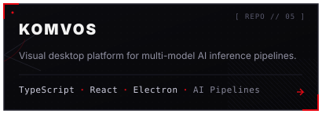
      </a>
    </td>
    <td align="center" width="50%" style="padding: 6px; border: none;">
      <a href="https://github.com/sakshamwadhankar/PS-4-_gdgNagpur_DeadPixel">
        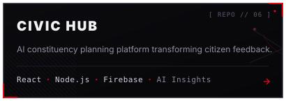
      </a>
    </td>
  </tr>
</table>

 

<!-- =================================================== -->
<!-- SECTION DIVIDER : HAND-DRAWN WEB FILAMENT           -->
<!-- =================================================== -->

  

 

<!-- =================================================== -->
<!-- STACK SECTION : COMIC ARSENAL / EQUIPMENT PANEL     -->
<!-- =================================================== -->

  

  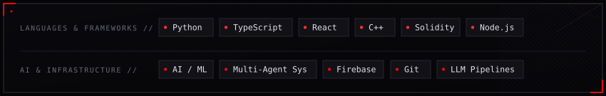

 

<!-- =================================================== -->
<!-- SECTION DIVIDER : HAND-DRAWN WEB FILAMENT           -->
<!-- =================================================== -->

  

 

<!-- =================================================== -->
<!-- GITHUB ACTIVITY : TELEMETRY & COMMIT MATRIX         -->
<!-- =================================================== -->

  

  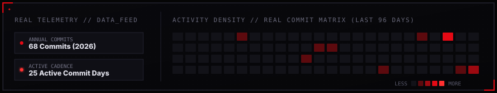

 

<!-- =================================================== -->
<!-- FOOTER : DANGLING SILK STRAND                       -->
<!-- =================================================== -->

  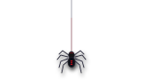
  

    // [ END_TRANSMISSION · SEC_071 ]
  

